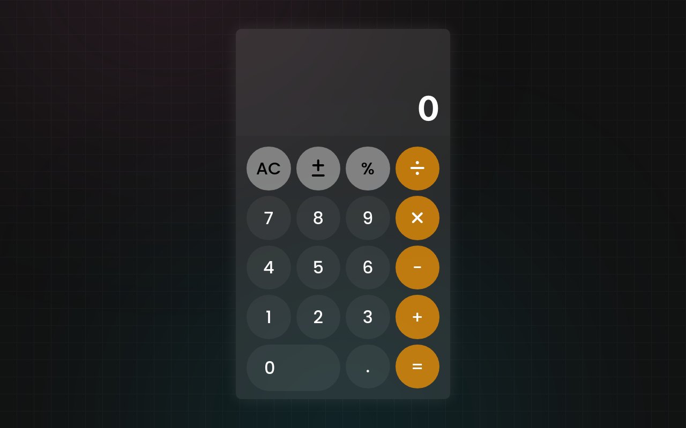

# Calculator App



## Overview

This is a simple calculator web application built using HTML, CSS, and JavaScript. The design is inspired by the sleek and intuitive calculator app found on iOS devices.

## Features

- **Basic Arithmetic Operations**: Perform addition, subtraction, multiplication, and division.
- **Responsive Design**: The calculator adapts to different screen sizes for a seamless user experience.
- **iOS Style**: The design mimics the look and feel of the calculator app on iOS devices.

## Demo

You can try out the live demo [here](https://rzanrzal.github.io/IOS-Calculator-in-JS/).

## Installation

1. Clone the repository:

   ```bash
   git clone https://github.com/your-username/calculator-app.git
   ```

2. Open the `index.html` file in your web browser.

## Usage

1. Press the numeric buttons to input numbers.
2. Use the operation buttons (+, -, \*, /) to perform calculations.
3. Press the "=" button to see the result.
4. Use the "C" button to clear the input.

## License

This project is licensed under the [MIT License](LICENSE).

Happy calculating! 🧮
