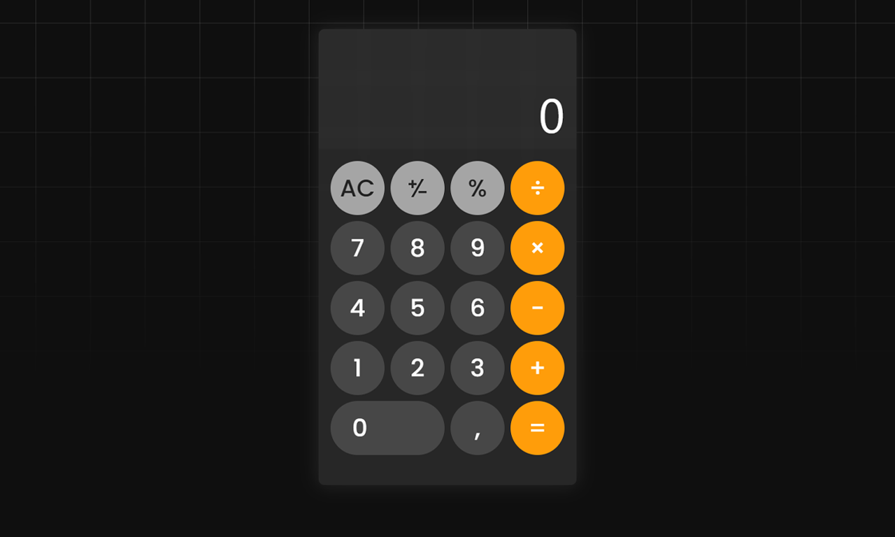

# Calculator App



## Overview

Welcome to the Vanilla JS iOS Calculator project! This solo endeavor aims to recreate the complete functionality of the iOS calculator in pure JavaScript, including advanced features like respecting mathematical operation precedence. Dive in to experience the versatility of JavaScript!

## Features

1. **Basic Operations**: Perform basic mathematical operations like addition, subtraction, multiplication, and division.

2. **Operation Precedence**: Advanced mathematical operation precedence is implemented. Multiplication and division are performed before addition and subtraction.

3. **Interactive UI**: A fully interactive user interface with buttons for each digit, operation, and special functions like clear, equals, plus-minus, and percent.

4. **Clear Functionality**: Clear the screen and reset all operations with the 'AC'/'C' button.

5. **Plus-Minus Function**: Toggle the sign of the current number on the screen with the plus-minus button.

6. **Percent Function**: Convert the current number on the screen to a percentage with the percent button.

7. **Error Handling**: Graceful error handling that displays 'Błąd' when the result of an operation is not a number (NaN) or infinity.

8. **Input Limit**: Restricts input to a maximum of 9 digits to prevent overflow.

9. **Continued Operations**: Continue operations on the result after pressing equals.

## Demo

You can try out the live demo [here](https://rzanrzal.github.io/IOS-Calculator-in-JS/).

## Installation

1. Clone the repository:

   ```bash
   git clone https://github.com/rzanrzal/IOS-Calculator-in-JS
   ```

2. Open the `index.html` file in your web browser.

## Usage

1. Press the numeric buttons to input numbers.
2. Use the operation buttons (+, -, \*, /) to perform calculations.
3. Press the "=" button to see the result.
4. Use the "C" button to clear the input.

## License

This project is licensed under the [MIT License](LICENSE).

Happy calculating! 🧮
